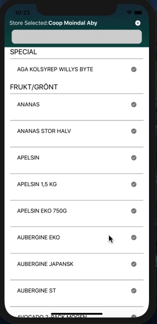
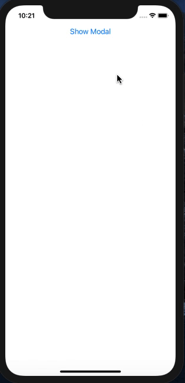

Assignment 12-03-21

The gradient project is inside screens folder which is inside of src.

Gradient consists of 2 components i.e. header and fruits which are inside of components

**Screenshots**

ModalEx is present in components which belongs is inside of src 

**Screenshots**

