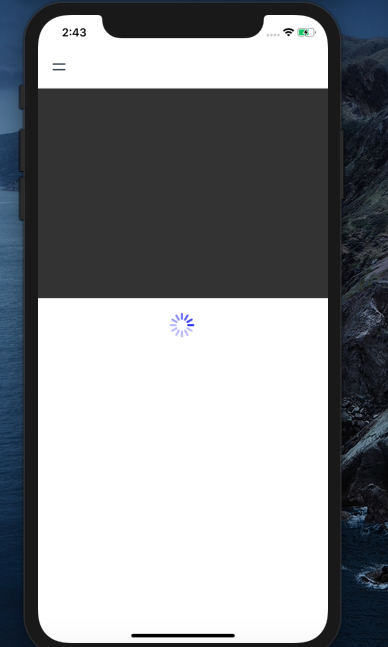
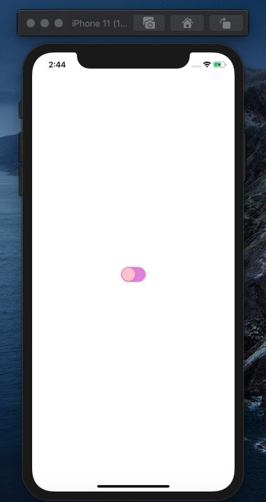
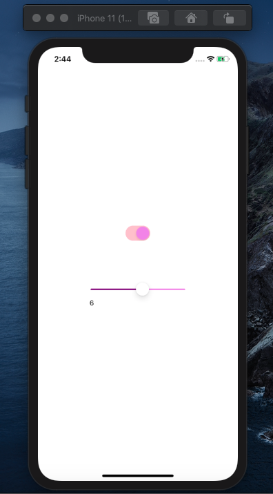
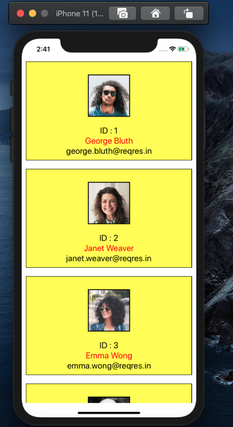

1. Implement WebView, show Activity indicator when WebView is loading

**Screenshots**

2. Use a switch to show hide the Slider and below slider show the slider value

**Screenshots**

3. Using api https://reqres.in/api/users?page=1 Render a Flatlist and implement pagination and pull to refresh show activity indicator below the flatlist when api is being called for the next page, use RefreshControl to show Activity indicator on top in case of pull to refresh

**Screenshots**

